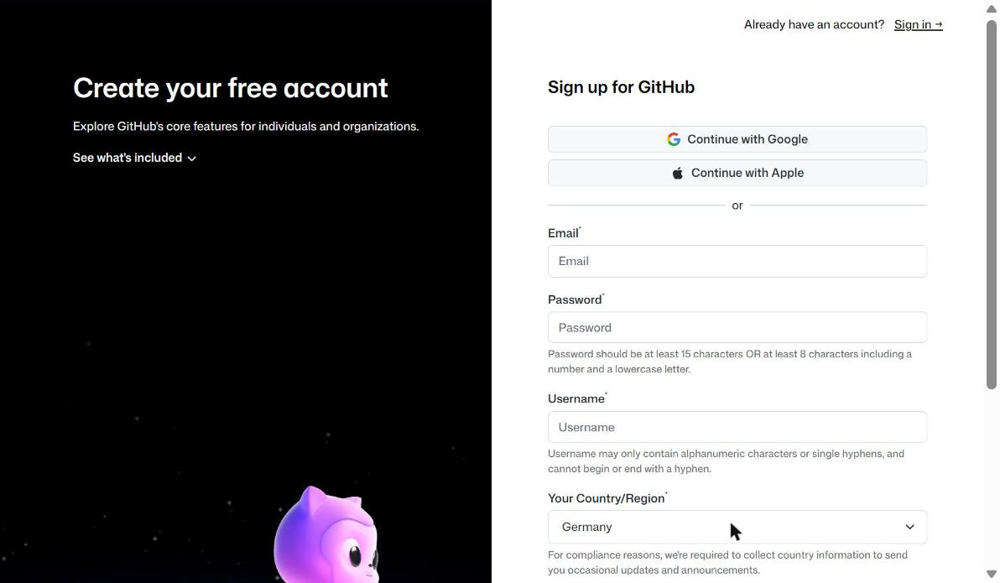
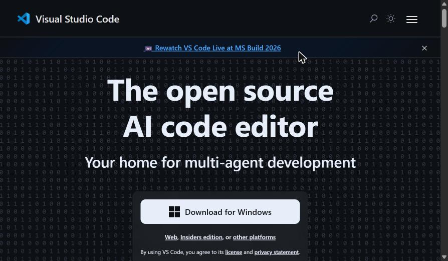
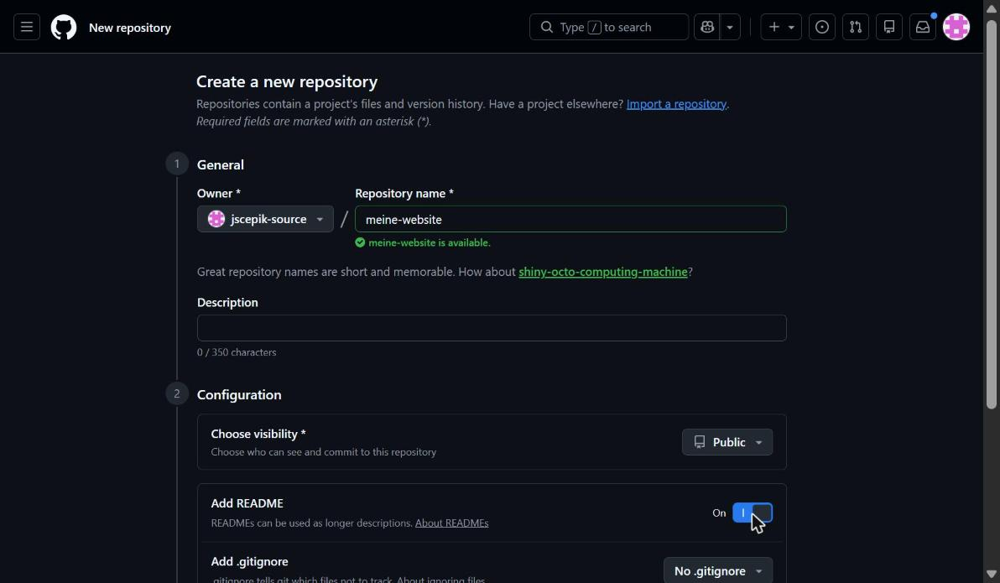
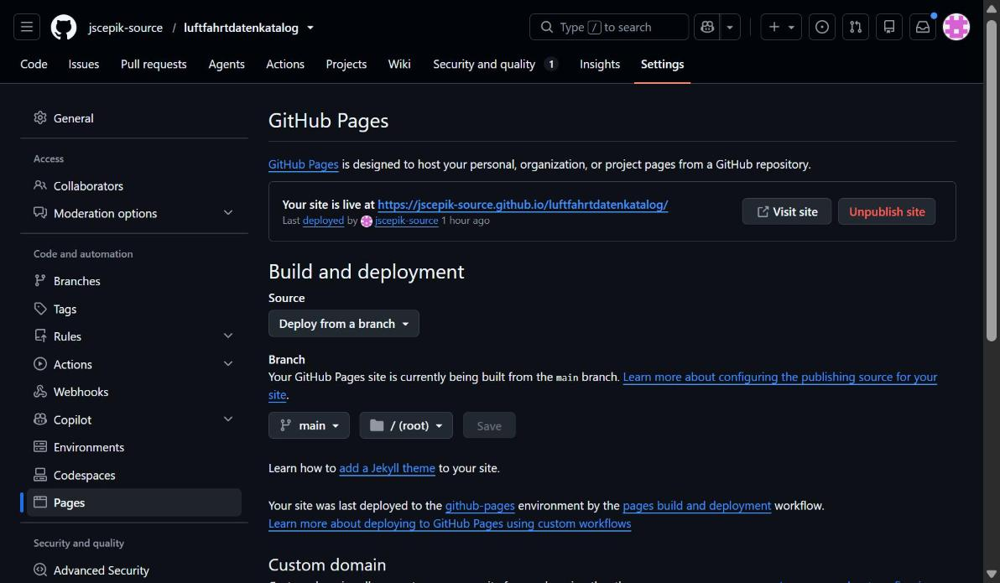

# 🚀 Schnellstart — Website in 8 Schritten (für absolute Anfänger)

Diese Anleitung bringt dich **von Null** bis zu einer **live im Internet sichtbaren Seite**. Kein Vorwissen nötig. Zeit: ca. 45 Minuten.

> Jeder Schritt hat: **was du tust** · **den genauen Link** · **was du danach siehst** · Platz für einen Screenshot.
> Ausführliche Version mit allen Details: [`ANLEITUNG_Website_mit_KI_bauen.md`](ANLEITUNG_Website_mit_KI_bauen.md)

---

## Überblick: Was passiert hier?

```
Du schreibst Dateien   →   lädst sie zu GitHub hoch   →   GitHub zeigt sie als Website
   (VS Code)                     (git push)                  (GitHub Pages)
```

Du brauchst 4 kostenlose Dinge: **GitHub-Konto**, **Git**, **VS Code**, **KI-Assistent**.

---

## Schritt 1 — GitHub-Konto erstellen

GitHub speichert deinen Code und zeigt deine Website kostenlos an.

1. Gehe zu **https://github.com/signup**
2. E-Mail eingeben → Passwort → Benutzername (z. B. `max-mustermann`) wählen
3. E-Mail bestätigen (Code aus der Mail eingeben)



**Danach siehst du:** deine leere GitHub-Startseite („Dashboard").

---

## Schritt 2 — Git installieren

Git lädt deine Dateien zu GitHub hoch.

1. Gehe zu **https://git-scm.com/download/win** (Windows) — der Download startet automatisch
2. Installer öffnen → bei allen Fragen einfach **„Next"** klicken → **„Install"**
3. Prüfen: **Eingabeaufforderung** öffnen (Windows-Taste → `cmd` tippen → Enter) und eintippen:
   ```
   git --version
   ```
   Es sollte eine Versionsnummer erscheinen (z. B. `git version 2.45`).

 


**Einmalig einrichten** (Name + E-Mail; ersetze durch deine Daten):
```
git config --global user.name "Dein Name"
git config --global user.email "deine@email.de"
```

---

## Schritt 3 — VS Code installieren

VS Code ist der Editor, in dem du (bzw. die KI) die Dateien schreibt.

1. Gehe zu **https://code.visualstudio.com**
2. Großen blauen Button **„Download for Windows"** klicken
3. Installer öffnen → **„Ich stimme zu"** → **„Weiter"** → **„Installieren"**



**Danach siehst du:** VS Code öffnet sich mit einer Willkommensseite.

---

## Schritt 4 — KI-Assistent (Claude Code)

Der KI-Assistent schreibt und ändert die Dateien für dich.

1. Gehe zu **https://claude.com/claude-code** und folge der Installationsanleitung
2. Alternativ: die **Claude-Weboberfläche** unter **https://claude.ai** — dann kopierst du den Code selbst in VS Code

> 💡 In diesem Projekt wurde **Claude Code** verwendet, weil es Dateien direkt bearbeiten kann.

---

## Schritt 5 — Repository (Projektordner) erstellen

Ein „Repository" ist dein Projektordner bei GitHub.

1. Gehe zu **https://github.com/new**
2. **Repository name:** z. B. `meine-website`
3. Auf **„Public"** stehen lassen
4. Häkchen bei **„Add a README file"** setzen
5. Grünen Button **„Create repository"** klicken



**Danach siehst du:** dein neues (fast leeres) Repository.

---

## Schritt 6 — GitHub Pages einschalten (Website aktivieren)

Damit wird aus deinem Repository eine echte Website.

1. In deinem Repository oben auf **„Settings"** klicken
2. Links im Menü auf **„Pages"** klicken
3. Unter **„Source"**: **„Deploy from a branch"** wählen
4. Branch auf **`main`** stellen, Ordner auf **`/ (root)`** → **„Save"**



**Danach siehst du (nach ~1 Minute):** oben erscheint deine Web-Adresse:
`https://DEIN-NAME.github.io/meine-website/`

---

## Schritt 7 — Erste Seite live bringen

Jetzt der komplette Kreislauf einmal von Hand.

1. Repository lokal holen — **Eingabeaufforderung** öffnen und eintippen (Namen anpassen):
   ```
   cd Desktop
   git clone https://github.com/DEIN-NAME/meine-website.git
   cd meine-website
   ```
2. **VS Code** öffnen: `code .` eintippen (oder Ordner in VS Code öffnen)
3. Neue Datei **`index.html`** anlegen und diesen Inhalt einfügen:
   ```html
   <!doctype html><html lang="de"><meta charset="utf-8">
   <title>Test</title><h1>Hallo Welt 🚀</h1>
   ```
4. Speichern (`Strg + S`), dann in der Eingabeaufforderung:
   ```
   git add index.html
   git commit -m "Erste Seite"
   git push
   ```
5. `https://DEIN-NAME.github.io/meine-website/` neu laden → **„Hallo Welt 🚀"** erscheint.

> 🖼️ **Screenshot:** *Browser mit der Live-Seite „Hallo Welt".* — ``

🎉 **Geschafft — deine erste Seite ist im Internet!**

---

## Schritt 8 — Ab jetzt: der Dreisatz

Für **jede** Änderung immer dieselben 3 Schritte:

```
1. Speichern   (Strg + S in VS Code)
2. git add .   und   git commit -m "was geändert"
3. git push    (hochladen)
```

Danach im Browser mit **Strg + F5** neu laden.

> 💡 Der KI-Assistent übernimmt Bearbeiten und oft auch das Hochladen für dich — du musst nur sagen, **was** du willst und **danach im Browser prüfen**.

---

## Wichtige Links auf einen Blick

| Wofür | Link |
|---|---|
| GitHub-Konto | https://github.com/signup |
| Git (Windows) | https://git-scm.com/download/win |
| VS Code | https://code.visualstudio.com |
| Claude Code (KI) | https://claude.com/claude-code |
| Neues Repository | https://github.com/new |
| Fertiges Beispiel (dieses Projekt) | https://jscepik-source.github.io/luftfahrtdatenkatalog/ |

---

## Screenshots einfügen (optional, 5 Min)

Willst du echte Bilder statt der Platzhalter?

1. Mach die Screenshots (Windows: **Windows-Taste + Umschalt + S**).
2. Lege sie in einen Ordner **`screenshots/`** neben diese Datei.
3. Benenne sie wie oben: `01-signup.png`, `02-git-version.png`, …
4. Ersetze im Text die Zeile `> 🖼️ **Screenshot:** …` durch ``.

---

*Wenn etwas klemmt: [`wiki/12-Troubleshooting.md`](wiki/12-Troubleshooting.md) — oder der KI genau sagen, was du siehst und was du erwartet hast.*
